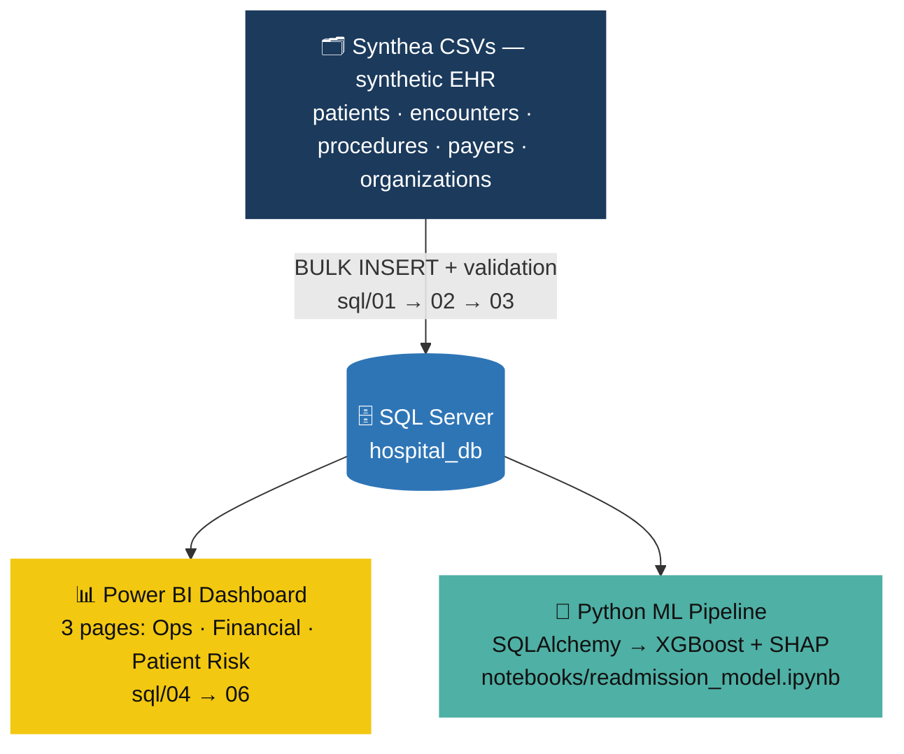

# HospitalIQ

### End-to-End Healthcare Analytics & ML Platform

**SQL Server → Power BI → Python/ML** — from a messy CSV drop to a validated database, a 3-page executive dashboard, and a 0.907-AUC readmission model, across 27,891 patient encounters.

<p align="left">
  
  
  
  
  
</p>

<p align="left">
  <a href="PowerBI/working_demo.mp4"></a>
  <a href="docs/HospitalIQ_project_report.pdf"></a>
  <a href="docs/data_quality_findings.md"></a>
</p>

---

## Overview
 
Most portfolio data projects are tutorials with a different dataset swapped in. HospitalIQ isn't — it's built to show how a single analyst-level workflow actually holds together end to end, across three connected layers (SQL, BI, ML) that all sit on one validated database, each accountable to the same source of truth.
 
It runs on [**Synthea**](https://synthetichealth.github.io/synthea/) synthetic EHR data — 100% synthetic, zero real patient information — deliberately structured to misbehave like real hospital data: a row silently dropped on ingest, blank-vs-`NULL` ambiguity, encounters logged after a patient's recorded death date. None of it was cleaned away quietly. It was investigated, decided on, and documented — because that judgment is the actual deliverable here, not the SQL itself.
 
**What this project is built to prove:**
 
| Skill | Evidence |
|---|---|
| Data engineering judgment | A silent `BULK INSERT` data-loss bug, caught via a foreign-key integrity check — not a row count, which would have missed it entirely. |
| Analytical honesty | Ambiguous business questions ("what's the readmission rate?") get *two* documented answers, not one silently chosen and hidden. |
| BI storytelling | A Power BI report designed to be read and understood in under 30 seconds by someone who's never seen the data. |
| ML with accountability | A model explained with SHAP, not just scored — plus a written caveats section on exactly where a 0.907 AUC would *not* hold up in production. |
 
**Stack:** SQL Server / T-SQL · Power BI Desktop · Python (pandas, scikit-learn, XGBoost, SHAP, SQLAlchemy, pyodbc)

## Table of Contents

- [Architecture](#architecture)
- [At a Glance](#at-a-glance)
- [Repository Structure](#repository-structure)
- [The Dashboard](#the-dashboard)
- [Data Quality & Interpretation](#data-quality--interpretation)
- [Machine Learning — 30-Day Readmission Model](#machine-learning--30-day-readmission-model)
- [Reproducing This Project](#reproducing-this-project)
- [Reports & Documentation](#reports--documentation)
- [Data Source](#data-source)
- [License](#license)

## Architecture



All three layers read from the same validated `hospital_db` — every number on the dashboard, in a query result, and inside the model traces back to one documented source of truth.

## At a Glance

| Metric | Value |
|---|---:|
| Patients / Encounters / Procedures | 974 / 27,891 / 47,701 |
| Coverage period | Jan 2011 – Feb 2022 |
| Total claims cost | $101.51M |
| 30-day readmission rate (broad definition) | 16.86% |
| Readmission model AUC — XGBoost vs. Logistic Regression | **0.907** vs. 0.805 |

## Repository Structure

```
HospitalIQ/
├── sql/           01–06: schema · data-quality audit · fixes · 3 analytics objectives
├── PowerBI/       HospitalIQ_Dashboard.pbix · theme · working_demo.mp4
├── notebooks/     readmission_model.ipynb · trained model · metrics · plots
├── pngs/          dashboard screenshots
├── docs/          data_quality_findings.md · project report (PDF/PPTX)
└── LICENSE
```

| Folder | README |
|---|---|
| [`sql/`](sql) — schema, cleaning, and the 3 analytics objectives | [`sql/README.md`](sql/README.md) |
| [`PowerBI/`](PowerBI) — the dashboard, theme, and demo video | [`PowerBI/README.md`](PowerBI/README.md) |
| [`notebooks/`](notebooks) — the readmission model | inline in [`readmission_model.ipynb`](notebooks/readmission_model.ipynb) |
| [`docs/`](docs) — data quality findings & the full project report | [`docs/data_quality_findings.md`](docs/data_quality_findings.md) |

## The Dashboard

A 3-page Power BI report — **Operations**, **Financial**, and **Patient Risk** — on a custom navy/acuity theme. Full walkthrough and the working demo video: [`PowerBI/README.md`](PowerBI/README.md).

<p align="center">
  
  
  
</p>

**Headline reads:**
- Ambulatory visits drive **44.95%** of all encounters, nearly double the next-largest category — most patient contact is routine, not emergency-driven — and **95.87%** of encounters resolve in under 24 hours.
- **Urgent care is the cost outlier**: 13.14% of encounters but 23% of total spend — the widest gap between volume share and cost share of any category.
- Inpatient stays average **~37 hours**, roughly 4× the next-longest category, and length of stay is heavily concentrated there.

## Data Quality & Interpretation

Every anomaly found during ingestion was investigated and documented as a decision, not silently patched:

- A `BULK INSERT` dropped 1 of 974 patients on a quoted-field parsing issue → caught via an orphan foreign-key check, re-imported, integrity restored.
- Blank CSV fields loaded as `''` instead of `NULL`, which would have silently broken mortality analysis → normalized with `NULLIF` / `TRY_CAST` across every optional column.
- 53 encounters occur *after* a patient's death date → kept for financial/administrative analysis, excluded from patient-behavior analysis.
- One patient with **1,381 lifetime encounters** (next-highest: 877) → confirmed as a plausible chronic-care profile and kept, not stripped as an outlier.

Several business questions also admit more than one valid reading. Rather than picking one silently, both are reported:

| Question | Interpretation | Alternative |
|---|---|---|
| "Zero payer coverage" | `PAYER_COVERAGE = 0` — 13,586 encounters (48.71%) | `PAYER = 'NO_INSURANCE'` — 8,807 encounters (31.58%) |
| "Readmitted within 30 days" | Any encounter within 30 days — 772 patients (~79%) | Inpatient-to-inpatient only — ~29 patients |

Full write-up with evidence and rationale for each: [`docs/data_quality_findings.md`](docs/data_quality_findings.md).

## Machine Learning — 30-Day Readmission Model

**Pipeline:** a single CTE-based SQL query (`LAG`/`LEAD`/`COUNT OVER`) engineers patient- and encounter-level features — age, class, cost, payer coverage, prior-encounter count, days since last visit — pulled from `hospital_db` via SQLAlchemy, then an 80/20 stratified split (22,312 train / 5,579 test, ~61.6%/38.4% class balance preserved) feeds two models.

| Model | AUC |
|---|---:|
| Logistic Regression (baseline) | 0.805 |
| **XGBoost** | **0.907** |

<p align="center">
  
</p>

The ROC comparison shows the ~10-point AUC gap that justifies XGBoost's extra complexity. SHAP feature importance confirms *why* it works: predictions are driven by **prior encounter count, days since last visit, claim cost, and age** — clinical signal, not demographic proxy. Race and gender rank near the bottom, which is exactly what a clinically credible model should show.

<p align="center">
  
  
</p>

The beeswarm adds direction on top of magnitude: a **recent prior visit and a high prior-encounter count push hard toward readmission**, while wellness-class encounters consistently push away from it — a pattern that matches clinical intuition about recent care escalations being the strongest readmission signal.

**Caveats:** Synthea data is cleaner than real EHR data, so 0.907 reflects that, not a real-world benchmark (production models on real data typically score 0.65–0.75). The model uses the broad readmission definition, and the one chronic-care outlier patient noted above has outsized influence on training — a production version would stratify by chronic-care status. Full discussion in the notebook.

## Reproducing This Project

1. Get the [Synthea](https://synthetichealth.github.io/synthea/) CSV export (`patients`, `encounters`, `procedures`, `payers`, `organizations`) and place it in `C:\HospitalData\`.
2. Run the SQL scripts **in order** in SSMS — see [`sql/README.md`](sql/README.md).
3. Open `PowerBI/HospitalIQ_Dashboard.pbix` in Power BI Desktop and point it at your local `hospital_db`.
4. Open `notebooks/readmission_model.ipynb` (`pandas`, `scikit-learn`, `xgboost`, `shap`, `sqlalchemy`, `pyodbc`), set the connection string, run all cells.

## Reports & Documentation

| Document | What's in it |
|---|---|
| [`docs/data_quality_findings.md`](docs/data_quality_findings.md) | The full audit trail — every issue found, root cause, fix, and the reasoning behind each interpretation decision. |
| [`docs/HospitalIQ_project_report.pdf`](docs/HospitalIQ_project_report.pdf) | The complete written project report. |
| [`docs/HospitalIQ_project_report.pptx`](docs/HospitalIQ_project_report.pptx) | Slide-deck version of the same report, for presentation. |

## Data Source

Walonoski J, Kramer M, Nichols J, et al. *Synthea: An approach, method, and software mechanism for generating synthetic patients and the synthetic electronic health care record.* JAMIA, March 2018. https://doi.org/10.1093/jamia/ocx079

## License

Released under the [MIT License](LICENSE).

## Author

**Sahaj K.**

[](https://github.com/k-sahaj)

---

<p align="center"><sub>Built on 100% synthetic patient data generated by <a href="https://synthetichealth.github.io/synthea/">Synthea</a>. No real patient information is used anywhere in this project.</sub></p>
