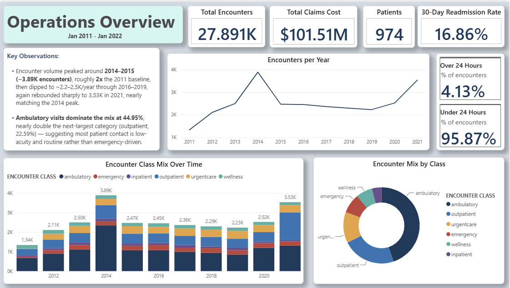
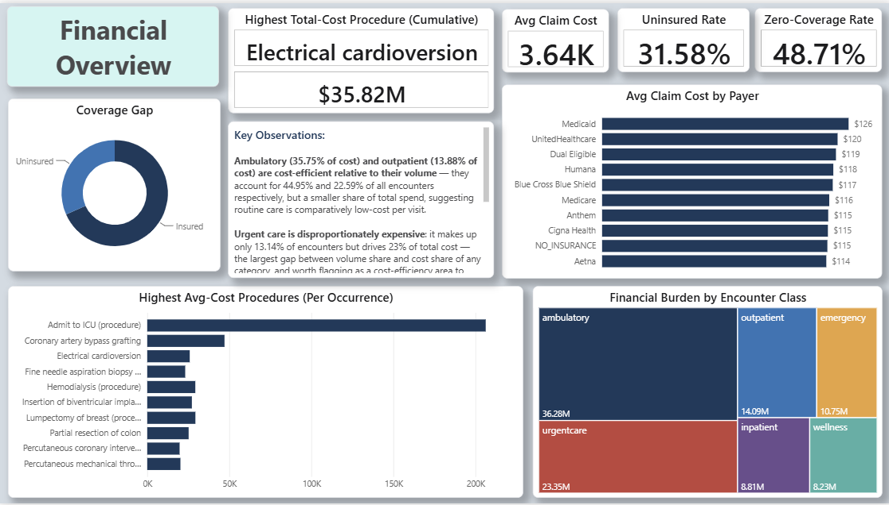
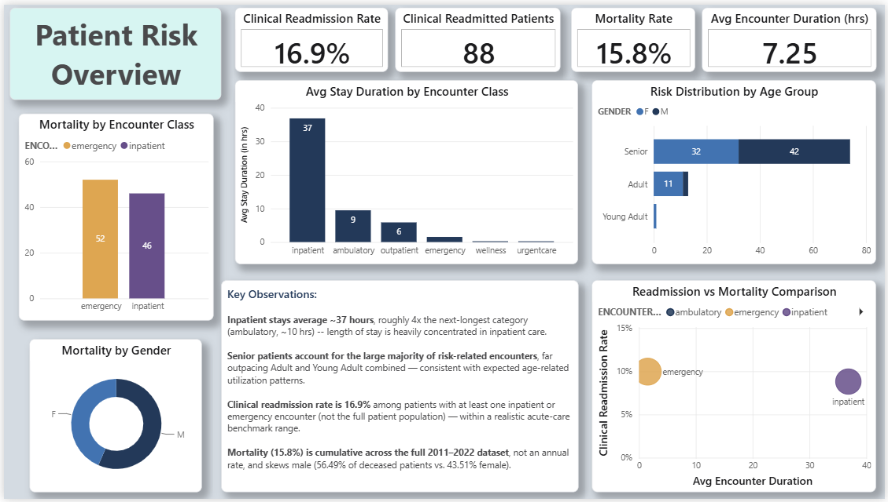
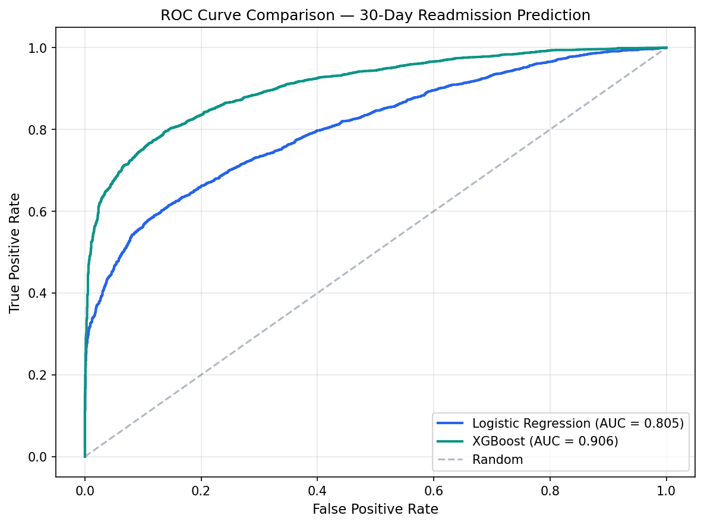
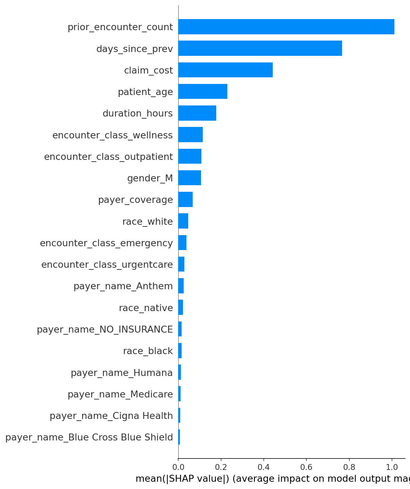
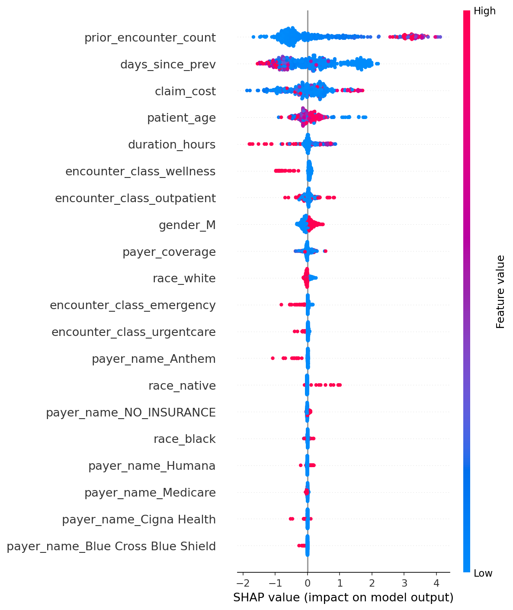

# HospitalIQ

### End-to-End Healthcare Analytics & ML Platform

**SQL Server → Power BI → Python/ML** — from a messy CSV drop to a validated database, a 3-page executive dashboard, and a 0.907-AUC readmission model, across 27,891 patient encounters.

<p align="left">
  
  
  
  
  
</p>

---

## Overview

HospitalIQ mirrors a real hospital operations & BI workflow end-to-end: raw CSVs are loaded into SQL Server, audited, cleaned with **documented, defensible decisions**, analyzed with T-SQL, visualized in an executive Power BI dashboard, and finally used to train a model that predicts 30-day patient readmission.

The dataset is [**Synthea**](https://synthetichealth.github.io/synthea/) synthetic EHR data — 100% synthetic, no real patient information — but structured to behave like genuine hospital data, warts and all: a dropped row on ingest, blank-vs-`NULL` ambiguity, encounters logged after a patient's recorded death date. Every quirk here was investigated and written up rather than quietly dropped or ignored, because that judgment is the actual point of the project.

> Raw data → validated data → SQL analytics → BI storytelling → predictive ML — with every interpretation decision documented, not buried in a query.

**Stack:** SQL Server / T-SQL · Power BI Desktop · Python (pandas, scikit-learn, XGBoost, SHAP, SQLAlchemy, pyodbc)

## Architecture

```
Synthea CSVs (synthetic EHR)
patients · encounters · procedures · payers · organizations
      │
      ▼   BULK INSERT + validation   (sql/01 → 02 → 03)
SQL Server — hospital_db
      │
      ├──────────────────┐
      ▼                   ▼
Power BI dashboard    Python ML pipeline
3 pages: Ops · Financial ·          SQLAlchemy → XGBoost + SHAP
Patient Risk   (sql/04–06)          (notebooks/readmission_model.ipynb)
```

All three layers read from the same validated `hospital_db` — every number on the dashboard, in a query result, and inside the model traces back to one documented source of truth.

## At a Glance

| Metric | Value |
|---|---:|
| Patients / Encounters / Procedures | 974 / 27,891 / 47,701 |
| Coverage period | Jan 2011 – Feb 2022 |
| Total claims cost | $101.51M |
| 30-day readmission rate (broad definition) | 16.86% |
| Readmission model AUC — XGBoost vs. Logistic Regression | **0.907** vs. 0.805 |

## Repository Structure

```
HospitalIQ/
├── sql/           01–06: schema · data-quality audit · fixes · 3 analytics objectives
├── PowerBI/       HospitalIQ_Dashboard.pbix · theme · working_demo.mp4
├── notebooks/     readmission_model.ipynb · trained model · metrics · plots
├── pngs/          dashboard screenshots
├── docs/          data_quality_findings.md · project report (PDF/PPTX)
└── LICENSE
```
Each folder has its own README with details specific to that layer.

## The Dashboard

A 3-page Power BI report — **Operations**, **Financial**, and **Patient Risk** — on a custom navy/acuity theme. Full walkthrough and the working demo video: [`PowerBI/README.md`](PowerBI/README.md).

<p align="center">
  
  
  
</p>

**Headline reads:**
- Ambulatory visits drive **44.95%** of all encounters, nearly double the next-largest category — most patient contact is routine, not emergency-driven — and **95.87%** of encounters resolve in under 24 hours.
- **Urgent care is the cost outlier**: 13.14% of encounters but 23% of total spend — the widest gap between volume share and cost share of any category.
- Inpatient stays average **~37 hours**, roughly 4× the next-longest category, and length of stay is heavily concentrated there.

## Data Quality & Interpretation

Every anomaly found during ingestion was investigated and documented as a decision, not silently patched:

- A `BULK INSERT` dropped 1 of 974 patients on a quoted-field parsing issue → caught via an orphan foreign-key check, re-imported, integrity restored.
- Blank CSV fields loaded as `''` instead of `NULL`, which would have silently broken mortality analysis → normalized with `NULLIF` / `TRY_CAST` across every optional column.
- 53 encounters occur *after* a patient's death date → kept for financial/administrative analysis, excluded from patient-behavior analysis.
- One patient with **1,381 lifetime encounters** (next-highest: 877) → confirmed as a plausible chronic-care profile and kept, not stripped as an outlier.

Several business questions also admit more than one valid reading. Rather than picking one silently, both are reported:

| Question | Interpretation used | Alternative |
|---|---|---|
| "Zero payer coverage" | `PAYER_COVERAGE = 0` — 13,586 encounters (48.71%) | `PAYER = 'NO_INSURANCE'` — 8,807 encounters (31.58%) |
| "Readmitted within 30 days" | Any encounter within 30 days — 772 patients (~79%) | Inpatient-to-inpatient only — ~29 patients |

Full write-up with evidence and rationale for each: [`docs/data_quality_findings.md`](docs/data_quality_findings.md).

## Machine Learning — 30-Day Readmission Model

**Pipeline:** a single CTE-based SQL query (`LAG`/`LEAD`/`COUNT OVER`) engineers patient- and encounter-level features — age, class, cost, payer coverage, prior-encounter count, days since last visit — pulled from `hospital_db` via SQLAlchemy, then an 80/20 stratified split (22,312 train / 5,579 test, ~61.6%/38.4% class balance preserved) feeds two models.

| Model | AUC |
|---|---:|
| Logistic Regression (baseline) | 0.805 |
| **XGBoost** | **0.907** |

<p align="center">
  
</p>

The ROC comparison shows the ~10-point AUC gap that justifies XGBoost's extra complexity. SHAP feature importance confirms *why* it works: predictions are driven by **prior encounter count, days since last visit, claim cost, and age** — clinical signal, not demographic proxy. Race and gender rank near the bottom, which is exactly what a clinically credible model should show.

<p align="center">
  
  
</p>

The beeswarm adds direction on top of magnitude: a **recent prior visit and a high prior-encounter count push hard toward readmission**, while wellness-class encounters consistently push away from it — a pattern that matches clinical intuition about recent care escalations being the strongest readmission signal.

**Caveats:** Synthea data is cleaner than real EHR data, so 0.907 reflects that, not a real-world benchmark (production models on real data typically score 0.65–0.75). The model uses the broad readmission definition, and the one chronic-care outlier patient noted above has outsized influence on training — a production version would stratify by chronic-care status. Full discussion in the notebook.

## Reproducing This Project

1. Get the [Synthea](https://synthetichealth.github.io/synthea/) CSV export (`patients`, `encounters`, `procedures`, `payers`, `organizations`) and place it in `C:\HospitalData\`.
2. Run the SQL scripts **in order** in SSMS — see [`sql/README.md`](sql/README.md).
3. Open `PowerBI/HospitalIQ_Dashboard.pbix` in Power BI Desktop and point it at your local `hospital_db`.
4. Open `notebooks/readmission_model.ipynb` (`pandas`, `scikit-learn`, `xgboost`, `shap`, `sqlalchemy`, `pyodbc`), set the connection string, run all cells.

## Data Source

Walonoski J, Kramer M, Nichols J, et al. *Synthea: An approach, method, and software mechanism for generating synthetic patients and the synthetic electronic health care record.* JAMIA, March 2018. https://doi.org/10.1093/jamia/ocx079

## License

Released under the [MIT License](LICENSE).

## Author

**Sahaj K.**

[](https://github.com/k-sahaj)


---

<p align="center"><sub>Built on 100% synthetic patient data generated by <a href="https://synthetichealth.github.io/synthea/">Synthea</a>. No real patient information is used anywhere in this project.</sub></p>
